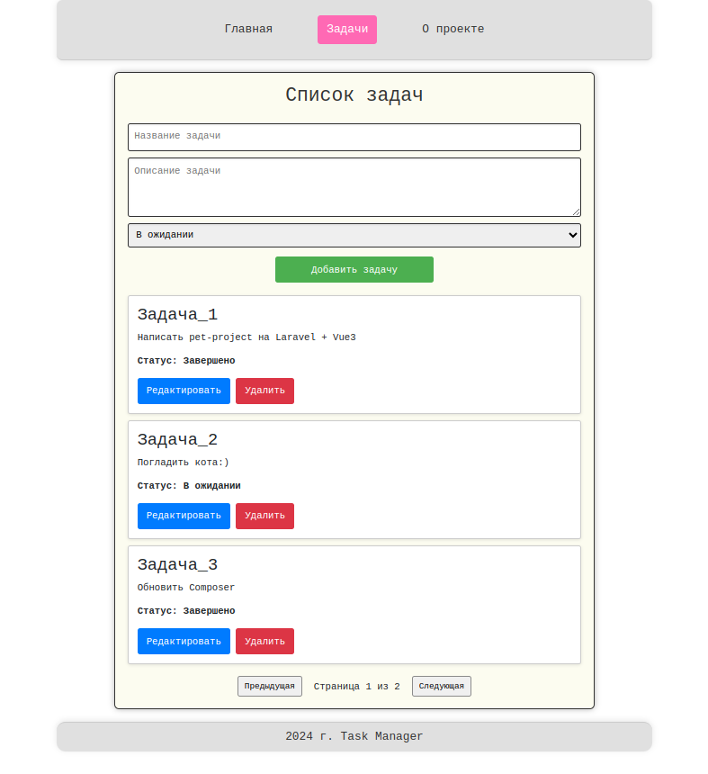

# Task Manager

**Task Manager** — это удобное приложение для управления задачами, разработанное для помощи пользователям в организации 
их времени и отслеживании прогресса выполнения различных задач.

## Функциональные возможности:
- Создание, редактирование и удаление задач
- Изменение статусов задач ("В ожидании", "В процессе", "Выполнена")
- Просмотр списка всех задач

## Стек технологий:
- **Backend**: Laravel (PHP 8.3)
- **Frontend**: Vue.js
- **База данных**: MySQL 8.0
- **Web-сервер**: Nginx
- **Контейнеризация**: Docker, Docker Compose

## Запуск проекта

Для развертывания проекта используйте Docker. Следуйте инструкциям ниже.

### 1. Клонирование репозитория

Сначала клонируйте проект на локальную машину:

```bash
git clone https://github.com/Andrey-Yurchuk/task_manager.git
```
Затем перейдите в директорию проекта:

```bash
cd task_manager
```
### 2. Создание .env файла

Создайте файл .env на основе имеющегося в проекте файла .env.example:

```bash
cp .env.example .env
```
### 3. Обновление файла .env

Откройте файл .env и добавьте необходимые значения, такие как:
- `APP_KEY` (можно сгенерировать с помощью команды `php artisan key:generate`)
- Обновите следующие параметры в `.env` для корректной работы проекта:

```bash
APP_NAME=TaskManager
APP_ENV=local
APP_KEY=<your_laravel_key>
APP_DEBUG=true
APP_TIMEZONE=UTC
APP_URL=http://127.0.0.1:4005
``` 
Также добавьте/обновите следующую переменную для работы с Vite.js (используется для сборки фронтенда):

```bash
VITE_APP_URL=http://localhost:4005
``` 
Параметры для базы данных MySQL, если вы используете MySQL:

```bash
DB_CONNECTION=mysql
DB_HOST=mysql
DB_PORT=3307
DB_DATABASE=task_manager
DB_USERNAME=<your_user>
DB_PASSWORD=<your_password>
``` 

### 4. Сборка и запуск контейнеров

Для того чтобы собрать и запустить контейнеры, выполните следующие команды:

```bash
docker-compose build
docker-compose up -d
``` 
⚠️ Команда docker-compose up -d не только поднимает контейнеры, но и выполняет внутри них команды, 
такие как npm install && npm run dev для Node.js.

Контейнеры будут подняты для следующих сервисов:

- Laravel - для приложения
- Nginx - для веб-сервера
- Node.js - для компиляции фронтенд-ресурсов
- MySQL - для базы данных

### 5. Миграции базы данных

После поднятия контейнеров выполните миграции для настройки базы данных:

```bash
docker exec -it <laravel-container-id> php artisan migrate
```
Где <laravel-container-id> — это ID контейнера с приложением Laravel. Узнать его можно с помощью команды:

```bash
docker ps
```

### 6. Доступ к приложению

После успешного запуска приложение будет доступно по адресу http://localhost:4005

### Дополнительные команды

- Сборка фронтенда: фронтенд автоматически собирается при запуске контейнеров, но если нужно пересобрать его вручную, выполните:

```bash
docker exec -it <node-container-id> npm run dev
```
- Установка пакетов для PHP: в проекте уже настроена установка зависимостей через Composer в Dockerfile, 
  поэтому не нужно вручную выполнять composer install. Эта команда выполняется автоматически при сборке PHP-контейнера.

### Cкриншот приложения



_На скриншоте выше показан пользовательский интерфейс приложения Task Manager для управления задачами._
